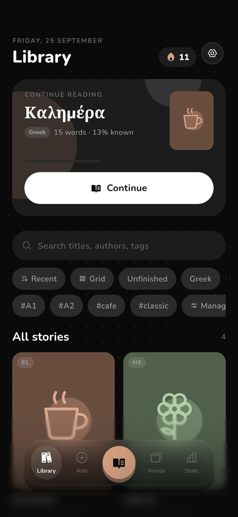
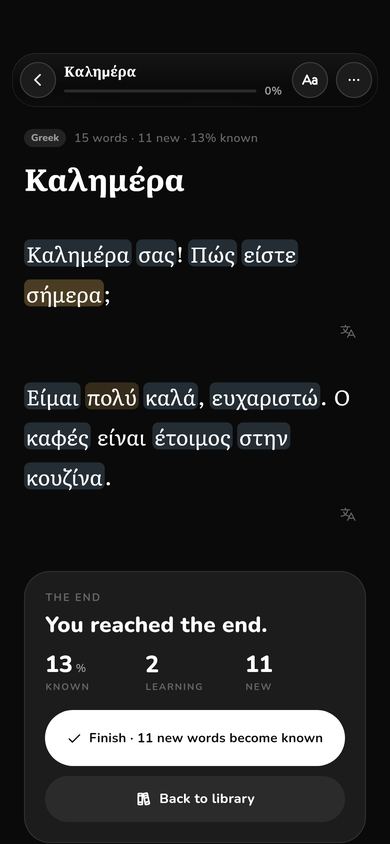
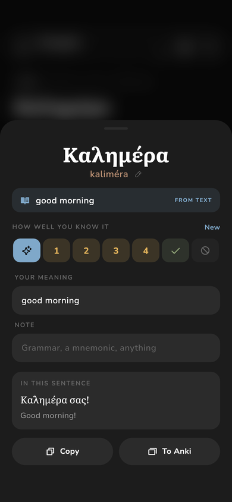
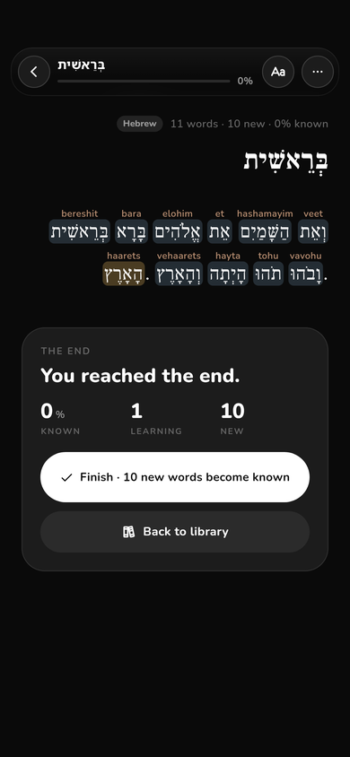
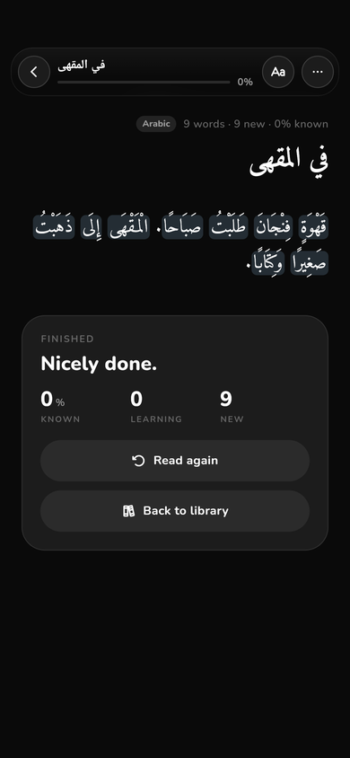
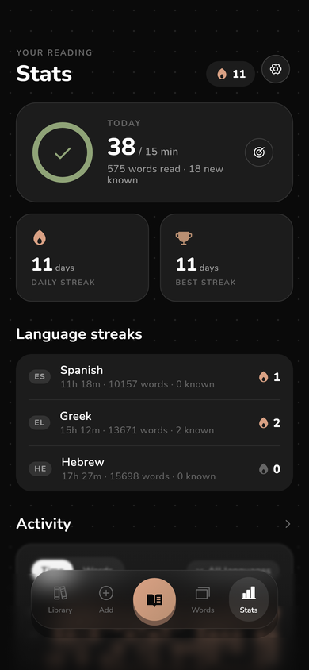
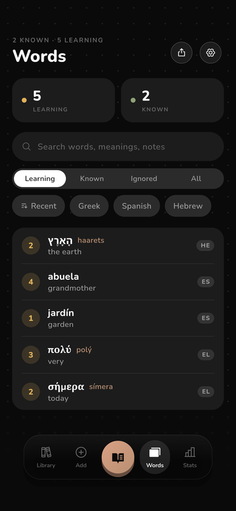
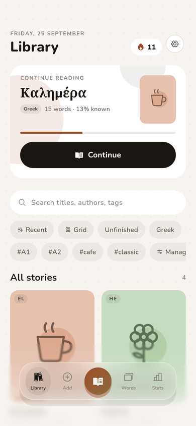

# Sefer

A private, offline-first reader for learning languages from texts you choose,
in the spirit of LingQ. Paste or import a text, read it in a calm and roomy
reader, and tap any word to see its gloss, its transliteration and how well
you know it. Words you haven't met are tinted blue and words you're learning
are tinted amber. Finishing a story marks the words you never tapped as known.

Sefer ships no content and has no network access. Everything you add stays on
the device until you export it.

<p>




</p>
<p>




</p>

## Features

- **Reader.** Words are spaced moderately and are easy to tap. You can change
  the typeface (eight bundled), size, line height, word and paragraph
  spacing, page width, margins and justification. Tap a word for its gloss,
  reading, level (new, 1–4, known, ignored), your own meaning and a note.
  Long-press a word for the sentence and its translation, which you can also
  write yourself. Transliteration can show above words, on tap, or not at
  all. Hebrew nikkud and Arabic harakat can be shown or hidden. Right-to-left
  scripts read right to left. The reader reopens where you stopped.
- **Library.** Covers can be your own image, one of 16 stock doodles or a
  generated pattern, in 8 colours. Stories can have tags and shelves, and you
  can filter by language, shelf or tag, search, sort, and switch between a
  grid and a list.
- **Add.** Paste or type plain text or JSON, or import `.json` and `.txt`
  files, several at a time. Several texts can go in one paste, separated by
  `===`. Every import is shown for review before it's saved.
- **Words.** Your whole vocabulary, with filters and search, and export to
  **Anki**: a TSV file for Anki or AnkiDroid, or a single card shared to
  AnkiDroid.
- **Stats.** Reading time, words read, words learned and sessions. A
  GitHub-style activity chart where you choose squares, rounded squares or
  dots, the colours, the number of weeks, cell size and gap, and the metric.
  A daily streak (optionally only on days you meet your goal) and a streak
  per language.
- **Make it yours.** Dark, light or automatic theme, or build your own with
  a live preview. Choose which tabs the nav bar shows and in what order.
  Screen transitions can blur, fade, slide, zoom or be off, with adjustable
  strength and speed. You can also set the background pattern and the
  interface text size.
- **Your data.** Back up everything, including covers, to one JSON file and
  restore it by merging or replacing. Export stories in the import format.
  Erase everything.

## Import format

One story is an object, and several stories are an array of objects. Only
`text` is required in a sentence. The other fields are optional, and
`tags`, `author` and `cover` (a doodle name such as `cup`) are also
accepted.

```json
{
  "title": "Καλημέρα",
  "language": "el",
  "translation_language": "en",
  "paragraphs": [
    {
      "sentences": [
        {
          "text": "Καλημέρα σας!",
          "translation": "Good morning!",
          "glosses": { "καλημέρα": "good morning", "σας": "to you (formal)" },
          "transliterations": { "καλημέρα": "kaliméra", "σας": "sas" }
        }
      ]
    }
  ]
}
```

Glosses and transliterations match words regardless of case, nikkud or
harakat, and fall back to ignoring accents. When a text has no
transliteration, Sefer generates one for Greek, Cyrillic (Russian,
Ukrainian, Bulgarian, Serbian and more), Hebrew, Arabic and Persian,
Georgian and Armenian.

## Privacy

- The release build has **no `INTERNET` permission**. It is removed
  explicitly in `AndroidManifest.xml`, so no dependency can add it back.
- Android cloud backup is disabled, so your data isn't uploaded to your
  Google account without you knowing.
- There are no accounts, analytics, ads or crash reporting.
- Reading time only counts while the reader is open and you've touched the
  screen in the last two minutes.

## Development

This is a Flutter app for Android. See [`PLAN.md`](PLAN.md) for the
architecture and [`DESIGN.md`](DESIGN.md) for the design language it
follows.

```sh
flutter pub get
flutter analyze
flutter test                     # unit and widget tests
flutter run                      # on a device or emulator
flutter build apk --release

# Re-render the screenshots in tool/shots/ with the real fonts:
flutter test tool/screenshots_test.dart --update-goldens
```

The code is organised like this:

```
lib/
  app/       app root, shell (nav bar, transitions), routes
  data/      models, AppState, JSON storage, importer, exporter, stats, file IO
  text/      tokenizer, normalisation, transliteration, script and direction
  theme/     colour tokens and type helpers
  widgets/   UI kit, glass, toast, motion, heatmap, covers
  screens/   library, add, reader, words, stats, settings, theme editor
```

Fonts are bundled under the SIL Open Font License (see `assets/fonts/OFL-*`).
Icons are [Phosphor](https://phosphoricons.com).
