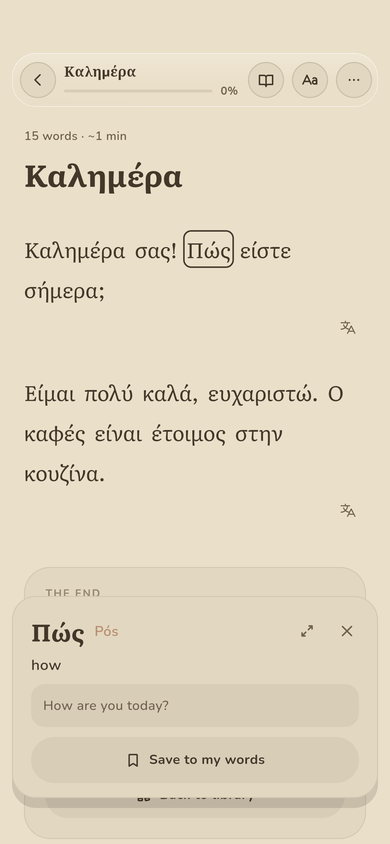
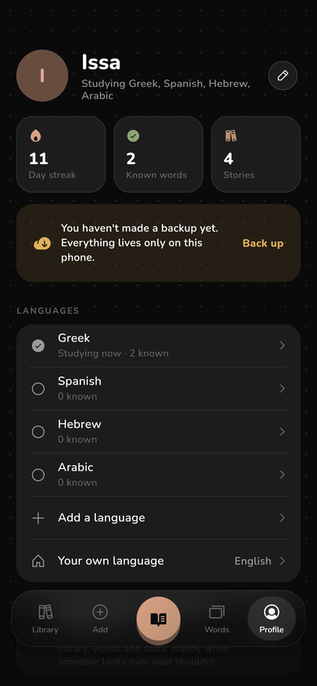
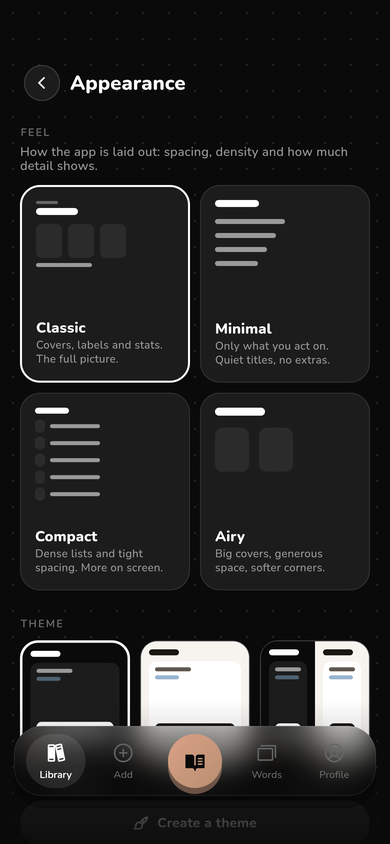
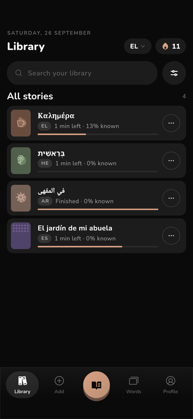
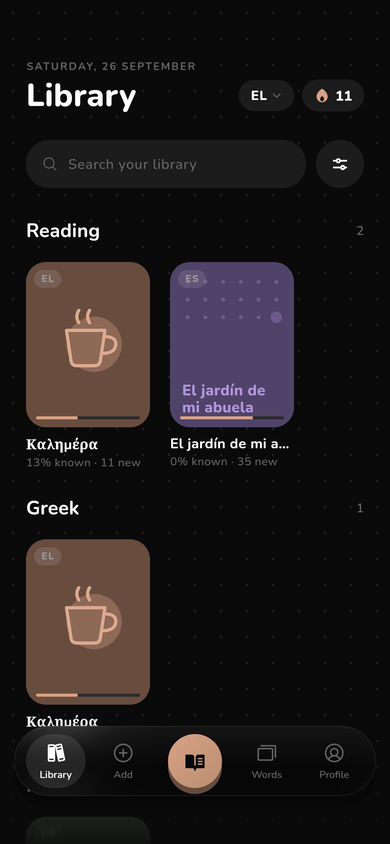

# Sefer

A private, offline-first reader for learning languages from texts you choose,
in the spirit of LingQ. Paste or import a text, read it in a calm and roomy
reader, and tap any word to see its gloss, its transliteration and how well
you know it. Words you haven't met are tinted blue and words you're learning
are tinted amber. Finishing a story marks the words you never tapped as known.

Sefer ships no content and has no network access. Everything you add stays on
the device until you export it.

<p>




</p>
<p>




</p>

## Features

- **Reader.** Each paragraph is drawn by a single render object (one text
  layout, highlights painted behind the glyphs, taps resolved by position),
  so long texts scroll smoothly.
  - **Learn mode:** blue and amber highlights, word levels (new, 1–4, known,
    ignored), your own meanings and notes. Double-tap a word to mark it
    known.
  - **Read mode:** plain text for skimming. A tap shows the meaning and the
    sentence translation in a small card.
  - A **compact word card** at the bottom of the screen, or the full sheet
    if you prefer it.
  - Transliteration above words or on tap. Nikkud and harakat can be shown
    or hidden. Right-to-left scripts read right to left, and the reader
    reopens where you stopped.
  - Paper colours (theme, paper, sepia, dusk, black). Text size, line,
    word, letter and paragraph spacing, page width, margins, bold,
    justification and indent. Highlight style (fill, underline or none)
    and strength. Fade paragraphs you've already read, keep the screen on,
    hide the bars while scrolling. "Next story" at the end.
- **Fonts.** 17 bundled reading faces:
  - Dyslexia-friendly: OpenDyslexic, Lexend, Andika, Atkinson
    Hyperlegible.
  - Hebrew: Heebo (close to SF Hebrew), Varela Round (close to SF Hebrew
    Rounded), Noto Sans Hebrew, Frank Ruhl Libre.
  - Arabic: Vazirmatn (close to SF Arabic), Baloo Bhaijaan (rounded), Noto
    Sans Arabic, Noto Naskh, Amiri.
  - You can set a different font per language, and **import your own
    .ttf/.otf** (for example SF Hebrew, which can't be redistributed).
- **Library.** One options sheet for the view (covers, shelves, list or
  titles), sort, grouping by language or shelf, favourites and filters.
  Covers can be an image, a stock doodle or a pattern. Stories get tags,
  shelves and favourites, and show time left from your own reading speed.
  Deleting a story can be undone.
- **Add.** Paste or type plain text or JSON, or import files, several at a
  time. Several texts can go in one paste, separated by `===`. Every import
  is reviewed before it's saved, with a warning for duplicates.
- **Words.** Your vocabulary with filters and search, and export to
  **Anki** (a TSV file, or a single card shared to AnkiDroid).
- **Stats.** Time, words, words learned and sessions. A GitHub-style
  activity chart (shape, colours, range, cell size). A daily streak and a
  streak per language.
- **Profile.** Your name and picture, the languages you study (switch the
  active one from any tab), your own language, and every setting. An
  optional **privacy mode** shows only the language you're studying now
  across the library, words and stats.
- **Make it yours.**
  - **App feel:** Classic, Minimal, Compact or Airy. Each changes spacing,
    density, corners, labels and how the library is laid out.
  - Themes, including your own built in the theme editor. An accent colour
    over any theme, corner roundness, interface font and text size.
  - Frosted glass on or off, a floating or docked nav bar with up to five
    tabs and an optional continue-reading button, and the tab the app opens
    on.
  - Screen transitions (blur, fade, slide, zoom or none).
- **Your data.** Back up everything to one file, with an optional
  reminder. Restore by merging or replacing. Export stories, export to
  Anki, or erase everything.

## Import format

One story is an object, and several stories are an array of objects. Only
`text` is required in a sentence. The other fields are optional, and
`tags`, `author` and `cover` (a doodle name such as `cup`) are also
accepted.

```json
{
  "title": "Καλημέρα",
  "language": "el",
  "translation_language": "en",
  "paragraphs": [
    {
      "sentences": [
        {
          "text": "Καλημέρα σας!",
          "translation": "Good morning!",
          "glosses": { "καλημέρα": "good morning", "σας": "to you (formal)" },
          "transliterations": { "καλημέρα": "kaliméra", "σας": "sas" }
        }
      ]
    }
  ]
}
```

Glosses and transliterations match words regardless of case, nikkud or
harakat, and fall back to ignoring accents. When a text has no
transliteration, Sefer generates one for Greek, Cyrillic (Russian,
Ukrainian, Bulgarian, Serbian and more), Hebrew, Arabic and Persian,
Georgian and Armenian.

## Privacy

- The release build has **no `INTERNET` permission**. It is removed
  explicitly in `AndroidManifest.xml`, so no dependency can add it back.
- Android cloud backup is disabled, so your data isn't uploaded to your
  Google account without you knowing.
- There are no accounts, analytics, ads or crash reporting.
- Reading time only counts while the reader is open and you've touched the
  screen in the last two minutes.

## Development

This is a Flutter app for Android. See [`PLAN.md`](PLAN.md) for the
architecture and [`DESIGN.md`](DESIGN.md) for the design language it
follows.

```sh
flutter pub get
flutter analyze
flutter test                     # unit and widget tests
flutter run --release            # judge smoothness on a release build;
                                 # debug builds are much slower
flutter build apk --release

# Re-render the screenshots in tool/shots/ with the real fonts:
flutter test tool/screenshots_test.dart --update-goldens
```

The code is organised like this:

```
lib/
  app/       app root, shell (nav bar, transitions), routes
  data/      models, AppState, JSON storage, importer, exporter, stats, file IO
  text/      tokenizer, normalisation, transliteration, script and direction
  theme/     colour tokens and type helpers
  widgets/   UI kit, glass, toast, motion, heatmap, covers
  screens/   library, add, reader, words, stats, settings, theme editor
```

Fonts are bundled under the SIL Open Font License (see `assets/fonts/OFL-*`).
Icons are [Phosphor](https://phosphoricons.com).
