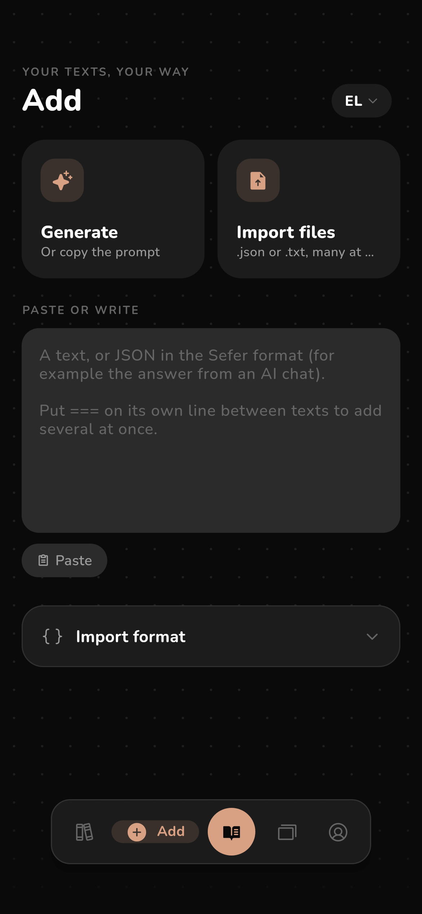
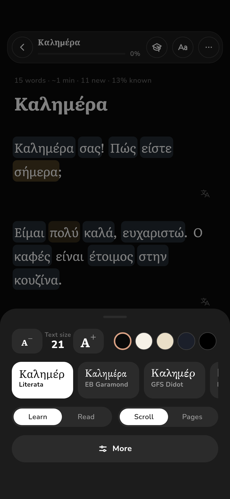
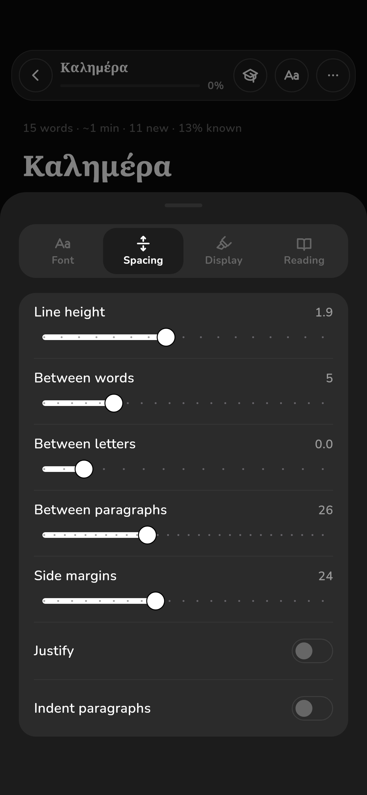
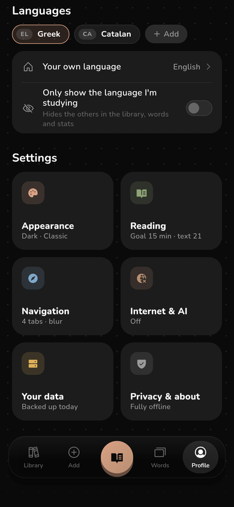
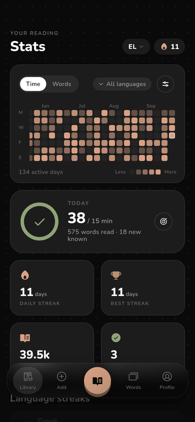
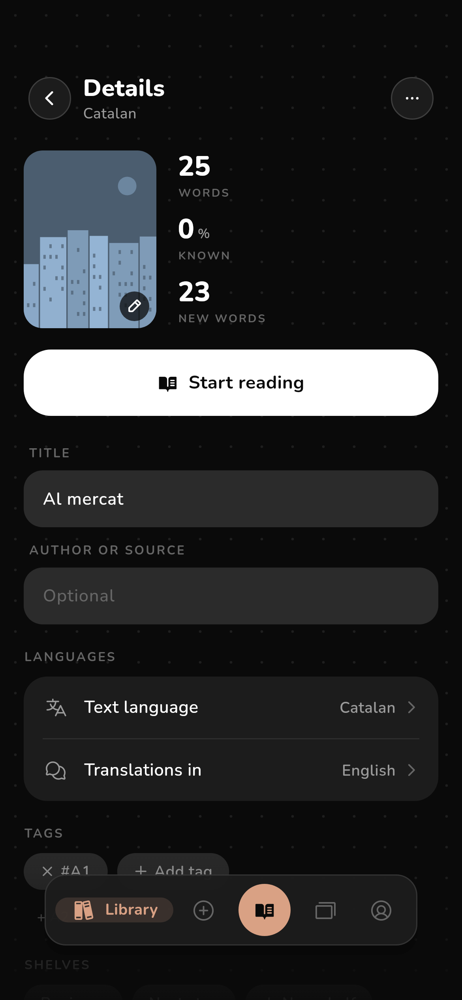
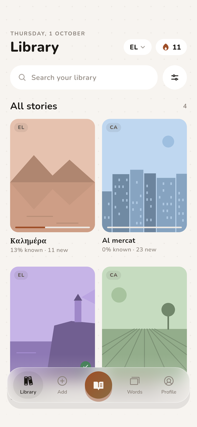

# Sefer

A private, offline-first reader for learning languages from texts you choose,
in the spirit of LingQ. Paste or import a text, read it in a calm and roomy
reader, and tap any word to see its gloss, its transliteration and how well
you know it. Words you haven't met are tinted blue and words you're learning
are tinted amber. Finishing a story marks the words you never tapped as known.

Sefer ships no content and stays offline unless you turn on the internet
switch to generate stories with your own AI key. Everything you add stays on
the device until you export it.

<p>


</p>
<p>



</p>
<p>




</p>
<p>




</p>
<p></p>

## Features

- **Reader.** Each paragraph is drawn by a single render object, so long
  texts scroll smoothly.
  - **Learn mode:** blue and amber highlights, word levels (new, 1–4, known,
    ignored), your own meanings and notes. Double-tap a word to mark it
    known.
  - **Read mode:** plain text for skimming. A tap shows the meaning and the
    sentence translation in a small card.
  - **Scroll or pages:** one long page, or pages you swipe or tap at the
    edges. Paragraphs break between pages at sentence ends.
  - Transliteration above words or on tap; nikkud and harakat shown or
    hidden; right-to-left scripts read right to left.
  - **Aa** opens a small popup for size, paper colour, font, mode and
    layout. **More** opens the rest in four tabs: Font, Spacing (line, word,
    letter and paragraph spacing, margins), Display and Reading.
  - A slim end-of-story row: how much you knew, a round check to finish,
    and links to the quiz and the next story.
- **Fonts.** Only faces that suit the story's script are offered, and the
  one you pick becomes that language's font.
  - Latin, Greek, Cyrillic: Literata, EB Garamond, PT Serif, GFS Didot
    (Greek), Inter, Poppins, Nunito, and the easier-to-read Atkinson
    Hyperlegible, Lexend, OpenDyslexic and Andika.
  - Hebrew: Frank Ruhl Libre, David Libre, Heebo, Rubik, Varela Round.
  - Arabic script: Amiri, Markazi Text, Vazirmatn, Reem Kufi, Baloo
    Bhaijaan.
  - Georgian: Noto Serif and Noto Sans Georgian. Other scripts use your
    phone's font, and you can import your own .ttf or .otf.
- **Library.** Covers, shelves, list or titles, with sort, grouping,
  favourites and filters in one options sheet. Covers are an image, one of
  twelve scenery illustrations or a pattern. Deleting a story can be undone.
- **Add.** Two cards, **Generate** and **Import files**, above a box to
  paste or write. Several texts can go in one paste, separated by `===`.
  Every import is reviewed first (tap a title to rename it).
- **Generate.** One screen: the languages, a topic (or a random one), the
  CEFR level and a teaching focus from that level, dials for length, parts
  and quiz questions, and switches for translations, glosses,
  transliteration, nikkud or harakat, a first-person retelling and a child
  reader. The prompt is a writing-and-teaching backbone plus the chosen
  level's description (vocabulary, grammar, sentence length, craft), so
  switching level changes what the model is asked for. You can read and
  copy the full prompt, send it to **Google Gemini** or **OpenRouter** with
  your own key, and leave the screen while it writes.
- **Translation.** Optionally route word and sentence translations to
  **DeepL**, **Google Translate** or your AI model (which sees the sentence,
  so it picks the right sense). Sentence translations are kept with the
  story.
- **Quizzes.** Multiple choice, yes or no, or true or false, with no typed
  answers. Each answer is marked and explained; you get a score, a rating
  and your best result. The quiz uses the reader's paper colours.
- **Words.** Your vocabulary with filters and search, and export to
  **Anki**.
- **Stats.** The activity chart first (squares or dots, your colours and
  range), then today, streaks, words read and words known, and totals. A
  day counts towards a streak once you've read for a minute.
- **Profile.** A card with your picture, name, streak, words and stories;
  your languages as chips; and settings in six places: Appearance, Reading,
  Navigation, Internet & AI, Your data, and Privacy & about. An optional
  privacy mode shows only the language you're studying now.
- **Make it yours.** App feels (Classic, Minimal, Compact, Airy); themes
  including Gruvbox, Catppuccin, Nord, Dracula, Owl and Owl night, and your
  own; an accent colour; five dock styles; screen transitions; and fifteen
  app icons, each one letter in a fitting face: aleph, bet, lamed and tav,
  Greek omega, Persian pe, Thai ko kai, Cyrillic de, eszett, É, a
  blackletter Q, Georgian ani, hiragana a, hangul han and Devanagari a. All
  of them follow Android's themed icons.
- **Your data.** Back up everything to one file, with an optional
  reminder. Restore by merging or replacing. Export stories or words.

## Import format

One story is an object, and several stories are an array of objects. Only
`text` is required in a sentence. The other fields are optional, and
`tags`, `author` and `cover` (a scene such as `lake`, `peaks` or `city`) are also
accepted. The title comes from `title` and can be changed during review.

```json
{
  "title": "Καλημέρα",
  "language": "el",
  "translation_language": "en",
  "paragraphs": [
    {
      "sentences": [
        {
          "text": "Καλημέρα σας!",
          "translation": "Good morning!",
          "glosses": { "καλημέρα": "good morning", "σας": "to you (formal)" },
          "transliterations": { "καλημέρα": "kaliméra", "σας": "sas" }
        }
      ]
    }
  ],
  "quiz": [
    {
      "question": "Τι λέμε το πρωί;",
      "translation": "What do we say in the morning?",
      "options": ["Καληνύχτα", "Καλημέρα", "Αντίο"],
      "answer": "Καλημέρα",
      "explanation": "Καλημέρα means good morning."
    },
    { "question": "Is «σας» formal?", "type": "yes_no", "answer": true },
    { "question": "Καλημέρα means good night.", "type": "true_false", "answer": false }
  ]
}
```

`quiz` is optional and goes after the paragraphs. A multiple-choice question
has `options` and an `answer`, given as the option's text or its number
(from 0). A `yes_no` or `true_false` question has `answer` `true` or `false`.
`translation` and `explanation` are optional. Questions without a usable
answer are skipped with a note in the review. `{"questions": [...]}` works
in place of the array too. Libraries saved by older versions are upgraded
when they load.

Glosses and transliterations match words regardless of case, nikkud or
harakat, and fall back to ignoring accents. When a text has no
transliteration, Sefer generates one for Greek, Cyrillic (Russian,
Ukrainian, Bulgarian, Serbian and more), Hebrew, Arabic and Persian,
Georgian and Armenian.

## Privacy

- **Internet is off by default.** The app declares the `INTERNET`
  permission only for the story generator and translation. Every request
  goes through `lib/data/ai.dart` or `lib/data/translate.dart`, which refuse
  to connect while the switch in Profile → Internet & AI is off. With it on,
  Sefer connects only when you generate a story, load the list of models or
  translate, and sends only that prompt or text: nothing else from your
  library, words or stats.
- API keys stay on the device and are left out of backups.
- Android cloud backup is disabled, so your data isn't uploaded to your
  Google account without you knowing.
- There are no accounts, analytics, ads or crash reporting.
- Reading time only counts while the reader is open and you've touched the
  screen in the last two minutes.

## Development

This is a Flutter app for Android. See [`PLAN.md`](PLAN.md) for the
architecture and [`DESIGN.md`](DESIGN.md) for the design language it
follows.

```sh
flutter pub get
flutter analyze
flutter test                     # unit and widget tests
flutter run --release            # judge smoothness on a release build;
                                 # debug builds are much slower
flutter build apk --release

# Re-render the screenshots in tool/shots/ with the real fonts:
flutter test tool/screenshots_test.dart --update-goldens

# Re-render the launcher icons (needs Pillow):
python3 tool/icon/make_icons.py
```

The code is organised like this:

```
lib/
  app/       app root, shell (nav bar, transitions), routes
  data/      models, AppState, JSON storage, importer, exporter, stats, file IO,
             prompt backbone and builder, AI and translation clients,
             generation, app icon switch
  text/      tokenizer, normalisation, transliteration, script and direction
  theme/     colour tokens, theme presets, feels and type helpers
  widgets/   UI kit, glass, toast, motion, heatmap, covers
  screens/   library, add, generator, reader, quiz, words, stats, settings,
             theme editor
```

The story prompt's backbone and level descriptions live in
`lib/data/prompt_text.dart`; edit them there and the generator picks them up.

Fonts are bundled under the SIL Open Font License (see `assets/fonts/OFL-*`);
the app icons use Noto Serif Hebrew and the display faces listed in
`tool/icon/fonts/README.md`, under the same licence.
Icons are [Phosphor](https://phosphoricons.com).
